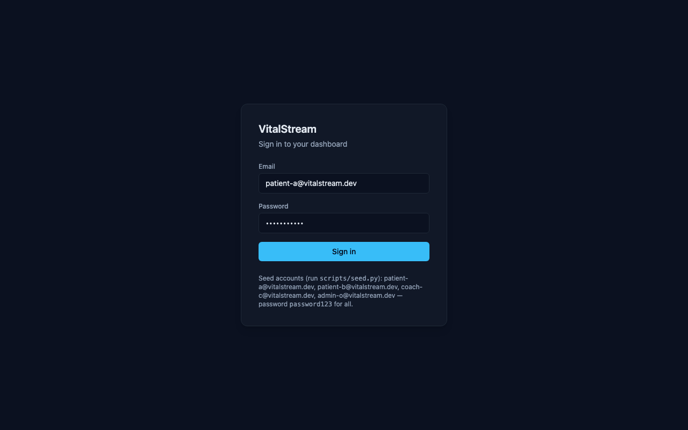

# VitalStream

Distributed Wearable Health Insights Platform — a personal engineering project that
takes high-frequency wearable signals (heart rate, HRV, sleep, activity) from ingestion
through feature extraction, LLM-based health insight generation, and a role-aware
full-stack delivery layer.

See [docs/PRD.md](docs/PRD.md) for the full product requirements doc and
[docs/architecture.md](docs/architecture.md) for the system diagram.

## Architecture

```
device_simulator (replays WESAD/PPG-DaLiA)
      │  HTTP (asyncio)
      ▼
┌─────────────────┐      ┌───────────────────┐      ┌──────────────────────┐
│ ingestion        │ ──▶ │ Redpanda           │ ──▶ │ feature_extraction    │
│ (asyncio+uvloop) │      │ (Kafka protocol)   │      │ (NumPy/SciPy,         │
└─────────────────┘      └───────────────────┘      │  gray-release aware)  │
                                                       └──────────┬───────────┘
                                  ┌────────────────────┬──────────┴───────────┐
                                  ▼                    ▼ (throttled, aggregated snapshot)
                       ┌────────────────┐   ┌────────────────────┐
                       │ Postgres        │   │ Redpanda            │
                       │ features table  │   │ features-extracted  │
                       │ (TimescaleDB    │   │  topic              │
                       │  hypertable:    │   └──────────┬──────────┘
                       │  Week 8+)       │              ▼
                       └────────────────┘   ┌────────────────────┐
                                             │ insight_service     │
                                             │ .consumer (LLM,     │
                                             │  Redis cache) →     │
                                             │  device_insights    │
                                             └──────────┬──────────┘
                                                         │
                                       (separately: a logged-in user can also
                                        trigger .main's on-demand endpoint)
                                                         ▼
                                              ┌────────────────────┐
                                              │ api (FastAPI)       │
                                              │ JWT/OAuth2 + RBAC   │
                                              │ + audit log         │
                                              └──────────┬──────────┘
                                                         ▼
                                              ┌────────────────────┐
                                              │ frontend (Next.js)  │
                                              └────────────────────┘

config_service (FastAPI+Pydantic) controls feature_extraction algorithm versions
(validate → gray release → rollback) — feature_extraction falls back to a
default algo_version if config_service isn't running, so Layer 1 doesn't
depend on it being up.

Cross-cutting: OpenTelemetry (tracing), Prometheus + Grafana (metrics), Docker,
GitHub Actions (CI/CD).
```

## Repo layout

```
services/
  ingestion/           Layer 1 — asyncio + uvloop signal ingestion, produces to Redpanda
  feature_extraction/  Layer 1 — NumPy/SciPy windowed feature extraction, gray-release aware
  config_service/      Layer 1 — versioned config: validate / gray release / rollback
  device_simulator/    Replays a real WESAD/PPG-DaLiA subject against the ingestion API
  insight_service/     Layer 2 — LLM-based insight generation, caching, eval, A/B testing
  api/                 Layer 3 — FastAPI backend: auth (OAuth2/JWT), RBAC, audit log
libs/common/           Shared Pydantic schemas + telemetry helpers used across services
frontend/              Layer 3 — Next.js dashboard (BFF auth, patient/coach/operator views)
scripts/               scripts/seed.py — demo accounts/devices/coach grants for local dev
infra/                 docker, prometheus, grafana, k6 load-test scripts, cloud VM bootstrap
data/                  Dataset download script + local data cache
docs/                  PRD, architecture docs, screenshots
```

`services/api/migrations/` holds api's Alembic revisions (schema baseline +
Week 6's RBAC/audit tables) — see "认证与权限" below for what it does and
doesn't own.

## Quick start

```bash
cp .env.example .env
docker compose up -d          # Kafka/Redis, Postgres, TimescaleDB, Prometheus, Grafana
make bootstrap                # create venvs and install each Python service in editable mode
services/api/.venv/bin/alembic -c services/api/alembic.ini upgrade head  # build api's Layer 3 tables
services/api/.venv/bin/python -m scripts.seed                           # demo accounts + devices
make test                     # run all service test suites

# Frontend (Week 7) — separate toolchain (Node, not Python)
cp frontend/.env.local.example frontend/.env.local
make frontend-install
make frontend-dev             # http://localhost:3000
```

Sign in at `http://localhost:3000/login` with any seed account
`scripts/seed.py` printed (`patient-a@vitalstream.dev`,
`patient-b@vitalstream.dev`, `coach-c@vitalstream.dev`,
`admin-o@vitalstream.dev`), password `password123` for all four.

Datasets (WESAD, PPG-DaLiA) are *not* fetched by the steps above — they're
only needed once a service actually replays them, so they're downloaded
directly on whichever machine runs `docker compose up`. On a fresh cloud VM,
[infra/cloud/bootstrap_vm.sh](infra/cloud/bootstrap_vm.sh) does the whole
thing (install Docker, clone this repo, `data/scripts/download_datasets.sh`,
`docker compose up -d`) in one shot. See [data/README.md](data/README.md).

Each service under `services/*` is an independently installable Python package
(`pip install -e .`) with its own `pyproject.toml` and `Dockerfile`, so it can run
standalone or as part of `docker compose`.

### Run the pipeline end-to-end (Layer 1 + Layer 2)

Once `docker compose up -d` and `make bootstrap` have run, and at least one
subject's data is under `data/raw/ppg_dalia/PPG_FieldStudy/` (see
[data/README.md](data/README.md)), run each of these in its own terminal.
`insight_service` needs a real `OPENAI_API_KEY` in `.env` to do anything
useful on a cache miss — without one it'll log-and-skip every generation
(Step 5's "调用失败时不要让整个consumer挂掉" applies to a missing key too).

```bash
services/config_service/.venv/bin/uvicorn config_service.main:app --app-dir services/config_service/src --port 8002
services/ingestion/.venv/bin/python -m ingestion.run
services/feature_extraction/.venv/bin/python -m feature_extraction.main
services/insight_service/.venv/bin/python -m insight_service.consumer
services/api/.venv/bin/uvicorn api.main:app --app-dir services/api/src --port 8000
services/device_simulator/.venv/bin/python -m device_simulator.replay --subject S2 \
  --device-id <the S2 device id scripts/seed.py printed>
cd frontend && npm run dev   # http://localhost:3000 — Week 7's UI on top of all of the above
```

Since Week 6/Layer 3, `ingestion` rejects any `device_id` that isn't a row
in `devices` (and any request missing the `X-Service-Token` header — the
simulator reads it from `$SERVICE_TOKEN`, matching `.env`), so run
`scripts/seed.py` first and pass one of the device ids it prints.

The simulator replays real wrist-PPG samples from PPG-DaLiA subject S2 as if
they were arriving live from a wearable (`--speed` controls playback speed;
default 20x). Within a couple of window-lengths you should see rows land in
Postgres:

```bash
docker exec vitalstream-postgres-1 psql -U vitalstream -d vitalstream \
  -c "SELECT device_id, feature_type, value, window_end FROM features ORDER BY window_end DESC LIMIT 10;"
```

To sanity-check the heart-rate algorithm itself against PPG-DaLiA's own
ground-truth labels (no live services needed):

```bash
services/feature_extraction/.venv/bin/python \
  services/feature_extraction/scripts/validate_ppg_dalia.py --subject S2 --plot
```

### Config management & gray release

`config_service` owns algorithm version state in Postgres (`algo_versions` +
`algo_version_audit` — every register/canary/promote/rollback call is
audited with an actor, action, and timestamp) and exposes it over HTTP.
`feature_extraction` polls `GET .../active` into an in-memory cache every 30s
(`CONFIG_REFRESH_INTERVAL_SECONDS` in `main.py`) rather than on every
message, and routes each *device* to a version by hashing its `device_id`
mod 100 against the canary's `rollout_pct` — so a given device stays on the
same version for the life of a rollout instead of flip-flopping per message.

```bash
# register the first stable version
curl -X POST localhost:8002/api/v1/config/feature-algo/register-stable \
  -d '{"algo_name":"heart_rate","version":"v1","actor":"you"}'

# gray-release a second version to 20% of devices
curl -X POST localhost:8002/api/v1/config/feature-algo \
  -d '{"algo_name":"heart_rate","version":"v2-naive-wideband","rollout_pct":20,"actor":"you"}'

# looks good? promote it to 100%
curl -X POST localhost:8002/api/v1/config/feature-algo/heart_rate/promote -d '{"actor":"you"}'

# looks bad? roll it back — works whether it's still a canary or already
# promoted to active (restores the previous version in the latter case)
curl -X POST localhost:8002/api/v1/config/feature-algo/heart_rate/v2-naive-wideband/rollback -d '{"actor":"you"}'

# who did what, when
curl localhost:8002/api/v1/config/feature-algo/heart_rate/audit-log
```

`features.HEART_RATE_ALGORITHMS` maps a version string to an actual
implementation — `v1` is the tuned algorithm, `v2-naive-wideband` is a real
(not synthetic) bad version: the pre-tuning parameters that scored ~37 bpm
MAE in `validate_ppg_dalia.py` before being fixed to ~8 bpm. Publishing it as
a canary and rolling it back is a genuine "ship a regression, catch it,
revert it" exercise, not a no-op toggle.

### Insights pipeline (Layer 2)

The PRD's second output path off of Layer 1: `feature_extraction` throttles
each device to at most one `InsightRequest` per `insight_throttle_seconds`
(default 60s), aggregating the last 5 windows into a snapshot
(`heart_rate_mean`/`heart_rate_trend`) rather than firing an LLM call per
8-second window — real products don't burn a token on every window, and
neither should this demo. Published to `features-extracted` (Kafka), never
by `insight_service` polling Postgres directly — same decoupling pattern as
Layer 1's `raw-signals` → `features` hop.

`insight_service.consumer` (distinct from `insight_service.main`'s
user-triggered, RBAC-gated `/insights/generate` HTTP endpoint — that one
persists to api's own `insights` table; this one is autonomous and owns its
own `device_insights` table) does, per request: normalize the snapshot to a
Redis cache key (rounded to 2 decimal places + prompt/model version, so
72.001 vs 72.002 bpm don't miss the cache) → on a hit, skip the LLM entirely;
on a miss, call OpenAI (one retry, 15s timeout, failures logged and skipped
rather than crashing the consumer), computing real cost from
`usage.prompt_tokens`/`completion_tokens` against a static price table
(`insight_service/pricing.py`) → persist the `DeviceInsight` either way,
`cache_hit`/`latency_ms`/`cost_usd` included (a hit costs $0 and takes
~1ms; a miss costs whatever the model call actually billed), so cache hit
rate and the latency/cost delta it buys are a query away, not a claim —
`insight_service.eval.cache_savings` runs that query and prints the
"缓存命中率 X%，节省了约 $Y / 降低了 Z ms" summary directly.

```bash
services/insight_service/.venv/bin/python -m insight_service.eval.cache_savings --limit 200
```

**Hit rate depends heavily on traffic shape, not just time elapsed** — see
[benchmarks/week5_eval_report.md](benchmarks/week5_eval_report.md) §2 for
the measured numbers: one continuously-varying device's own snapshots rarely
repeat exactly (0.2% hit rate over a full real replay), but multiple devices
in similar physiological states organically collide on the same rounded
snapshot constantly (56.9% across a synthetic fleet resting near the same
heart rate) — this cache pays off at fleet scale, not from one device
running longer.

### Evaluation & A/B testing

`benchmarks/cases.yaml` is 22 hand-written cases (4 categories: normal,
elevated heart rate, HRV drop, boundary/edge cases) — each with human-written
`checks` describing what a grounded, safe response should do, not full
expected-output text (exact-matching LLM output isn't realistic).
`insight_service.eval.judge` scores exactly two dimensions on purpose
(more would make the eval framework more complex than the thing it's
evaluating): `check_grounded` is a rule-based check (does the described
trend direction match the data, does the text cite an actual number) —
no LLM needed for that half. `check_hallucination` calls an LLM judge
(same or a different model, configurable) with a strict yes/no + reason
prompt, JSON-parsed; a judge failure scores as unscored (`None`), never a
silent "no hallucination found".

```bash
services/insight_service/.venv/bin/python -m insight_service.eval.run_benchmark --prompt-version v1 --model gpt-4o-mini
services/insight_service/.venv/bin/python -m insight_service.eval.run_benchmark --prompt-version v2 --model gpt-4o-mini
```

Each run calls the real LLM directly (bypassing Redis on purpose — eval
measures generation quality, not cache hits) and writes one row per case to
`benchmarks/results/{timestamp}_{prompt_version}_{model}.csv`, plus a
grounded_rate/hallucination_rate/avg_latency/avg_cost summary to stdout.
`v1` vs `v2` is a real, measured comparison, not a hypothetical one:
**grounded_rate 18.2% → 95.5%**, at the cost of ~32% more latency and ~40%
more cost per call. See
[benchmarks/week5_eval_report.md](benchmarks/week5_eval_report.md) for the
full comparison table, the chart, and — more interesting than the headline
number — why v2 actually helps (not the failure mode the project originally
guessed it would fix) and a real bug the eval process itself caught along
the way.

### 认证与权限 (Layer 3, Week 6)

**角色定义**：`patient`（只能访问自己的数据）、`coach`（只能访问被显式授权的
patient）、`admin`（平台运维，PRD 里的 "operator" 概念——代码里统一叫
`admin`，没有为同一角色引入两个名字）。

**两层 RBAC**：

1. **角色级**（`api/rbac.py: require_role`）：端点级别的粗粒度门禁，比如
   `POST /config/feature-algo` 只允许 `admin`。
2. **资源级**（`api/deps.py: authorize_user_access` / `authorize_device_access`）：
   同一个角色内，谁能访问哪条具体数据。`patient` 只能是自己；`coach` 必须在
   `coach_patient` 表里有一行显式授权记录，否则一律拒绝——没有这张表，"coach
   能看患者数据" 就退化成 "coach 能看所有人数据"。两个依赖都以数据库里的归属
   关系为准（例如 `authorize_device_access` 先查 `devices.user_id`），不信任
   JWT payload 或路径参数里的任何 id。

**越权返回码的取舍**：本项目里越权统一返回 `403`，而不是把 "不存在" 和 "无权
访问" 都伪装成 `404`。原因是这套 RBAC 面向的是 patient/coach/admin 三种已知
身份之间的内部协作场景（不是防止外部人枚举陌生 `user_id`），`403` 能让前端
（Week 7）清楚区分 "这条路径你走错了" 和 "这个人根本不存在"，调试体验更好；
真正未知的 id（比如 device 不存在）仍然返回 `404`。这与很多公开 SaaS API 的
惯例相反，是刻意的选择，面试如果问起就是这个理由。

**安全基线**（Step 8 清单，逐条已过一遍）：

- [x] `JWT_SECRET_KEY`/`SERVICE_TOKEN` 来自环境变量，`.env` 在 `.gitignore`
      里，仓库里没有真实密钥。
- [x] 解码 token 时用 `algorithms=[settings.jwt_algorithm]` 显式指定白名单
      （`api/auth.py`），拒绝 `alg: none` 类型的伪造 token；`exp` 由 PyJWT
      自动校验。
- [x] access token 30 分钟过期；refresh token 7 天，`jti` 落库
      `refresh_tokens`，`logout` 真正撤销它——纯无状态 JWT 做不到这一点。
- [x] 密码用 bcrypt 哈希；`login` 对 "用户不存在" 和 "密码错误" 返回完全相同
      的错误信息（防枚举）。
- [x] 所有非公开端点都有认证依赖——`tests/test_route_auth.py` 遍历
      `app.routes` 断言这件事，而不是靠人工检查。
- [x] CORS 只允许 `http://localhost:3000`（Week 7 前端），不是 `["*"]`。
- [x] `login` 有基础限流（`api/rate_limit.py`：单进程固定窗口计数器，够用但
      不是分布式方案——这个项目单进程部署，上 Redis 是过度设计）。
- [x] 响应用独立的 `UserOut`/`DeviceOut` 等 pydantic 模型，从不直接把 ORM
      对象序列化出去，`hashed_password` 永远不会出现在响应里。
- [x] 数据库查询全部参数化：ORM 查询天然如此；`routers/features.py` 里唯一
      的裸 SQL 用 SQLAlchemy `text()` + 具名绑定参数，没有 f-string 拼 SQL。

**审计日志只记录敏感操作**（`api/audit.py`）：跨用户健康数据读取
（`insights.read`/`features.read`，仅当 `actor.id != target_user_id`）、配置
变更（`config.publish_canary`/`config.rollback`）、认证事件
（`auth.login_success`/`auth.login_failed`）、以及 `api/deps.py` 里所有资源
级授权失败（`status='denied'`）。自己读自己的数据不写审计——全量记录会把
"谁看了谁的数据" 这个真正有价值的问题淹没在噪音里。写入与业务操作同事务、
同步提交，不走 Kafka：这些端点低频，丢一条审计记录是合规问题，可以接受的
性能代价换来的是"审计不会丢"的保证。`GET /audit-logs` 本身也有权限收敛：
`coach` 只能看到自己触发的、或指向自己被授权 patient 的记录；只有 `admin`
能看全量——审计接口自己权限没做对，是最讽刺也最常见的一类漏洞。

**Alembic 与跨服务表的边界**：`services/api/migrations` 只管理 `api` 自己
的表（`users`/`devices`/`coach_patient`/`insights`/`refresh_tokens`/
`audit_logs`）。`features`（feature_extraction 拥有）和 `device_insights`
（insight_service 拥有）虽然物理上在同一个 Postgres 实例里，但 schema 由各
自服务的 `Base.metadata.create_all` 管理——`api` 只用只读裸 SQL 查询它们
（`routers/features.py`），不去用 Alembic 给别的服务的表加外键。跨服务共享
物理数据库、各自管理各自 schema 是这个项目从 Week 1 就定下的边界，这周没有
改变它；`insights.device_id -> devices` 这类外键因此也没有加，取舍在这里
写清楚而不是假装做了。同理，`config_service` 自己的 `algo_version_audit`
表也保留不动，没有并入 `api` 的 `audit_logs`：它是 `config_service` 自己
`GET .../audit-log` 端点的数据源，服务边界内自洽；`api` 的 `audit_logs`
额外记录的是 `config.publish_canary`/`config.rollback` 这两个操作*谁通过
api 触发的*（`actor_id`/`ip_address` 这些 api 才知道的身份信息），两张表
回答的是不同的问题（"这个 algo 的版本历史" vs "谁在什么时候做了什么"），
合并会丢失后者身份维度或引入跨服务写耦合，所以保留两张表是有意的选择。

### API 使用

```bash
# 1. 登录拿 token（scripts/seed.py 建的账号，密码统一是 password123）
curl -s -X POST localhost:8000/api/v1/auth/login \
  -d "username=patient-a@vitalstream.dev&password=password123" | tee /tmp/login.json
ACCESS=$(python3 -c "import json;print(json.load(open('/tmp/login.json'))['access_token'])")

# 2. 查自己的健康洞察（Week 4-5 链路真实生成的数据，不是 mock）
curl -s localhost:8000/api/v1/users/<patient-a-id>/insights \
  -H "Authorization: Bearer $ACCESS"

# 3. 越权被拒：用 patient A 的 token 查 patient B 的数据 -> 403
curl -s -o /dev/null -w "%{http_code}\n" localhost:8000/api/v1/users/<patient-b-id>/insights \
  -H "Authorization: Bearer $ACCESS"

# 4. 审计留痕：用 coach C（已被授权访问 A）登录后查审计日志
curl -s -X POST localhost:8000/api/v1/auth/login \
  -d "username=coach-c@vitalstream.dev&password=password123" | tee /tmp/coach.json
COACH_ACCESS=$(python3 -c "import json;print(json.load(open('/tmp/coach.json'))['access_token'])")
curl -s localhost:8000/api/v1/users/<patient-a-id>/insights -H "Authorization: Bearer $COACH_ACCESS"
curl -s localhost:8000/api/v1/audit-logs -H "Authorization: Bearer $COACH_ACCESS"
```

This is also the Week 8 demo recording's script for the "企业级交付" segment.

### 前端架构 (Layer 3, Week 7)

`frontend/` is a Next.js 14 App Router app — Tailwind for styling (hand-rolled
primitives in `components/ui/`, not shadcn/ui: its CLI pulls component
source from a registry over the network at generation time, which doesn't
fit a non-interactive build environment; the components it would have
generated are simple enough to write directly), TanStack Query for all
server-state fetching/caching/polling, Recharts for the trend chart.

**Auth is BFF-mode, not "call the API from the browser"**:

```
browser  ──(same-origin, cookie rides along)──▶  Next.js Route Handlers  ──(Authorization: Bearer)──▶  api (:8000)
           /api/auth/{login,logout,me}
           /api/proxy/[...path]  (everything else)
```

- `POST /api/auth/login` forwards to FastAPI, then writes the returned
  access/refresh tokens into **httpOnly** cookies (`lib/server/cookies.ts`)
  and returns only `{id, email, role, display_name}` to the browser — the
  tokens themselves never reach client JS.
- `GET/POST /api/proxy/[...path]` is the one door every client component
  knocks on (`lib/apiFetch.ts`) for actual data. It reads the access-token
  cookie, adds `Authorization`, and forwards to `api`. A `401` triggers one
  single-flight refresh (`lib/server/refresh.ts` — a module-scope in-flight
  promise, so five widgets 401-ing at once produces one refresh call, not
  five racing ones) and a retry; a `403` passes straight through untouched
  — conflating "your token is stale" with "you don't have access" would
  retry-loop a permission denial forever.
- **Why not `localStorage`**: an XSS payload can read `localStorage` but
  can't read an httpOnly cookie — that's the whole point. The trade-offs
  that come with it: an extra network hop (browser → Next → FastAPI instead
  of straight to FastAPI), Next.js's server becomes a required component
  (no static-only deploy), and CSRF has to be handled by `SameSite=Lax` +
  only using `POST` for writes (a `GET` can't be CSRF'd into mutating
  state). Week 6's CORS allowlist (`localhost:3000`) exists for Swagger/curl
  debugging only — the app itself never makes a cross-origin request.
- `middleware.ts` redirects a visitor with no refresh cookie away from
  `/dashboard`, `/patients`, `/admin` before the page even renders, and
  `components/RoleGate.tsx` shows a clean "Access denied" instead of a
  403'd page full of broken widgets when a role doesn't match a route.
  **Neither of these is a security boundary** — they only improve what an
  already-logged-out or wrong-role visitor sees. The actual authorization
  decision is made exactly once, in FastAPI, by Week 6's RBAC dependencies;
  a request that bypassed the frontend entirely (raw curl) gets exactly the
  same answer.

**Types**: `lib/api-types.ts` is meant to be generated —
`npm run gen:api` runs `openapi-typescript` against a live api service's
`/openapi.json`. It ships hand-written for now (this environment couldn't
run the full Postgres+api stack to generate against), matching the actual
Pydantic response models in `services/api/src/api/routers/*.py` as of this
week; regenerate it once you have the stack up, per the comment at the top
of that file.

**On-demand insight generation isn't a 202-then-poll flow.** Week 6's
`POST /insights/generate` is synchronous (it reuses insight_service's Redis
cache directly, same machinery the autonomous pipeline uses — see that
router's comment) rather than publishing to Kafka and returning `202`. So
`lib/hooks/useGenerateInsight.ts` just awaits the call, with a 60s client-side
abort so a stuck LLM call can't spin the button forever — functionally the
same guarantee ("don't wait/poll forever") as a bounded poll loop, adapted
to how this endpoint actually works. The dashboard's insight feed itself
*is* a merge of two sources (`api`'s on-demand `insights` table + Week 4's
autonomous `device_insights` table, joined server-side in
`GET /users/{id}/insights` — see that endpoint's comment), so a manually
generated insight and the continuous background pipeline's output land in
the same list either way.

### 界面截图



Only the login page is captured here — it's the one screen that renders
without a live `api`/Postgres/Redpanda stack behind it, which this
environment didn't have running. Once you have `docker compose up -d` +
`scripts/seed.py` + the simulator running, capture the rest the same way
(`npx playwright test` also exercises every screen below as a side effect):

- Patient dashboard (`/dashboard`, logged in as `patient-a@vitalstream.dev`)
  — insight card with cache/cost metadata, feature trend chart with a
  gray-release version marker if you've run a canary.
- Coach patient detail (`/patients/<patient-a-id>`, logged in as
  `coach-c@vitalstream.dev`) — same components as the dashboard, reused.
- Unauthorized access (`/patients/<patient-b-id>`, still as coach C) — the
  "Access denied" state from `components/RoleGate.tsx`/the page's own 403
  handling.
- Audit log (`/admin/audit`, logged in as `admin-o@vitalstream.dev`) with
  "仅看被拒绝" toggled on, showing the denied row from the previous screenshot.

### Observability (tracing)

`docker compose up -d` includes Jaeger (`jaegertracing/all-in-one`) — UI at
[localhost:16686](http://localhost:16686). `ingestion` and
`feature_extraction` both call `vitalstream_common.telemetry.configure_tracing()`
and export spans via OTLP/HTTP to Jaeger. The interesting part isn't the
per-service spans (FastAPI is auto-instrumented) — it's that they're all
*one trace* across two processes: `ingestion.kafka_producer` injects the
current span's W3C trace context into the outgoing Kafka message's headers,
and `feature_extraction.main`'s consumer loop extracts it back out and
continues the same trace instead of starting a new one. Search for any
recent trace under service `ingestion` and you'll see:

```
POST /api/v1/devices/{id}/signals   (ingestion, HTTP)
└─ consume raw-signal               (feature_extraction, Kafka)
   ├─ compute feature (bandpass+peaks)
   ├─ produce features-topic
   └─ write features row (postgres)
```

one span per stage from device upload to DB write, with real per-stage
latency (typically: Postgres write and Kafka produce dominate; the actual
signal-processing math is comparatively cheap).

## Status

Layers 1-2 (PRD milestones: Week 1-2 through Week 5) are working end-to-end:

- **Week 1-2**: the device simulator replays real PPG-DaLiA wrist-BVP data
  over HTTP, ingestion batches it onto Redpanda, and feature_extraction
  derives heart rate via a bandpass-filter + peak-detection pipeline (tuned
  against ground truth — see `validate_ppg_dalia.py`; naive parameters
  produced a ~37 bpm MAE from picking up the PPG dicrotic notch as a second
  peak per beat, tightened to ~8 bpm), persisting `Feature` rows to Postgres.
- **Week 3**: `config_service` gray-releases feature-algo versions (Postgres-
  backed, audited, hash-bucketed per device — live-verified: a 20% canary
  landed in exactly 20/100 devices' feature rows, and rollback dropped that
  to 0/100 within one 30s cache-refresh cycle); a full ingestion→Kafka→
  feature_extraction→Postgres trace is visible in Jaeger; and benchmarking
  ingestion found a real bug (the producer was blocking each HTTP response on
  a full Kafka ack, not just returning 202 immediately) — fixing it measured
  ~4.8x throughput / ~6.5x P50 latency at fixed concurrency. See
  [benchmarks/results.md](benchmarks/results.md) for the full methodology,
  including a couple of benchmarking dead ends worth knowing about before
  trusting any throughput number on this stack.
- **Week 4**: `feature_extraction` throttles per-device output onto
  `features-extracted` (Kafka-decoupled, not Postgres-polled); `insight_service
  .consumer` turns aggregated snapshots into cached, LLM-generated advice.
  Live-verified end-to-end against real PPG-DaLiA replay and a real OpenAI
  key: generated insights correctly referenced the actual heart-rate numbers
  and trend direction (not templated filler), a real rate-limit/quota error
  was hit mid-run and the consumer logged-and-skipped it without crashing
  (features kept flowing throughout), and the fixed-precision cache key
  produced a genuine, unforced 13/26 (50%) cache hit rate during a short
  partial replay — Week 5's fuller run tells a more complete story (below).
- **Week 5**: real eval, not a placeholder — `benchmarks/cases.yaml` (22
  hand-written cases) scored on two dimensions (rule-based groundedness,
  LLM-judge hallucination detection). A real, measured prompt A/B:
  **grounded_rate 18.2% → 95.5%** (v1 → v2), for a real cost — ~32% more
  latency, ~40% more cost per call. The fix targeted a *different* problem
  than the one this project started out expecting (v1 essentially never
  hallucinated; it just too often skipped citing the actual number it was
  given), which only showed up because the benchmark was run for real
  instead of assumed. Real per-call cost from OpenAI's actual token usage
  (not estimated) is now in every `device_insights`/`Insight` row.
  Draining a full 514-row single-device replay to completion (not a partial
  snapshot mid-backlog) put the real organic cache hit rate at 0.2% — very
  different from Week 4's 50%, because a fleet of similar devices, not one
  continuously-varying device, is what actually drives this cache's hit
  rate (confirmed: 56.9% across 40 synthetic devices resting near the same
  heart rate). See [benchmarks/week5_eval_report.md](benchmarks/week5_eval_report.md).

- **Week 6**: `api` grew from a scaffold into a real control-plane service —
  OAuth2/JWT auth with revocable refresh tokens, two-layer RBAC (role +
  resource, the latter backed by a real `coach_patient` grants table rather
  than "coach sees everyone"), and an audit log scoped to what PRD 5.3
  actually asks for (cross-user reads, config mutations, auth events, denials)
  instead of a blanket request log. Alembic now owns api's own schema
  (`services/api/migrations`); Week 3's config `/admin/*` routes stayed
  proxied through `api`'s RBAC+audit layer (already done then, verified this
  week); `ingestion`'s signal endpoint gained service-token auth and rejects
  unregistered devices. See "认证与权限"/"API 使用" above for the design
  tradeoffs and a runnable demo script; `tests/test_rbac.py` /
  `tests/test_route_auth.py` / `tests/test_audit.py` are the permission-matrix
  and audit-trail tests backing the three acceptance-demo claims.

- **Week 7**: `frontend` — a Next.js App Router dashboard, BFF-authenticated
  (httpOnly cookies, never `localStorage`; see "前端架构" above for the
  full rationale) against Week 6's `api`. Patient/coach share one dashboard
  component (`components/PatientDashboard.tsx`) parameterized by `userId`,
  so "coach views an authorized patient" is a reuse, not a second
  implementation. Two backend gaps surfaced while wiring the frontend up
  and were fixed this week rather than worked around: `GET
  /coach/patients` didn't exist (coach_patient was write-only), and
  `GET /users/{id}/insights`/`GET /features/{device_id}`'s `before`/
  `start_ts`/`end_ts` cursor params were bound as raw strings against
  timestamp columns — duck-typed into working on sqlite's test DB, but a
  real bug against asyncpg/Postgres that unit tests hadn't caught (fixed via
  explicit `datetime.fromisoformat` parsing + typed SQLAlchemy bind params,
  see `tests/test_pagination.py`). `POST /insights/generate` also changed
  from "caller supplies a hand-built features dict" to "caller supplies a
  device_id, api pulls the latest per-feature-type value itself" — the
  original shape had no answer for "what does a browser button actually
  send." Three Playwright specs (`frontend/e2e/`) encode this week's three
  acceptance-demo claims; they need the full stack up to run (not available
  in the environment this was built in — see "界面截图" for what could and
  couldn't be verified directly here).

Layer 3's control plane (Week 6) and dashboard (Week 7) are both now real,
not scaffolds. See [docs/PRD.md](docs/PRD.md) section 7 for the full
milestone plan (Week 8: load testing, monitoring dashboards, CI/CD, demo
recording).
