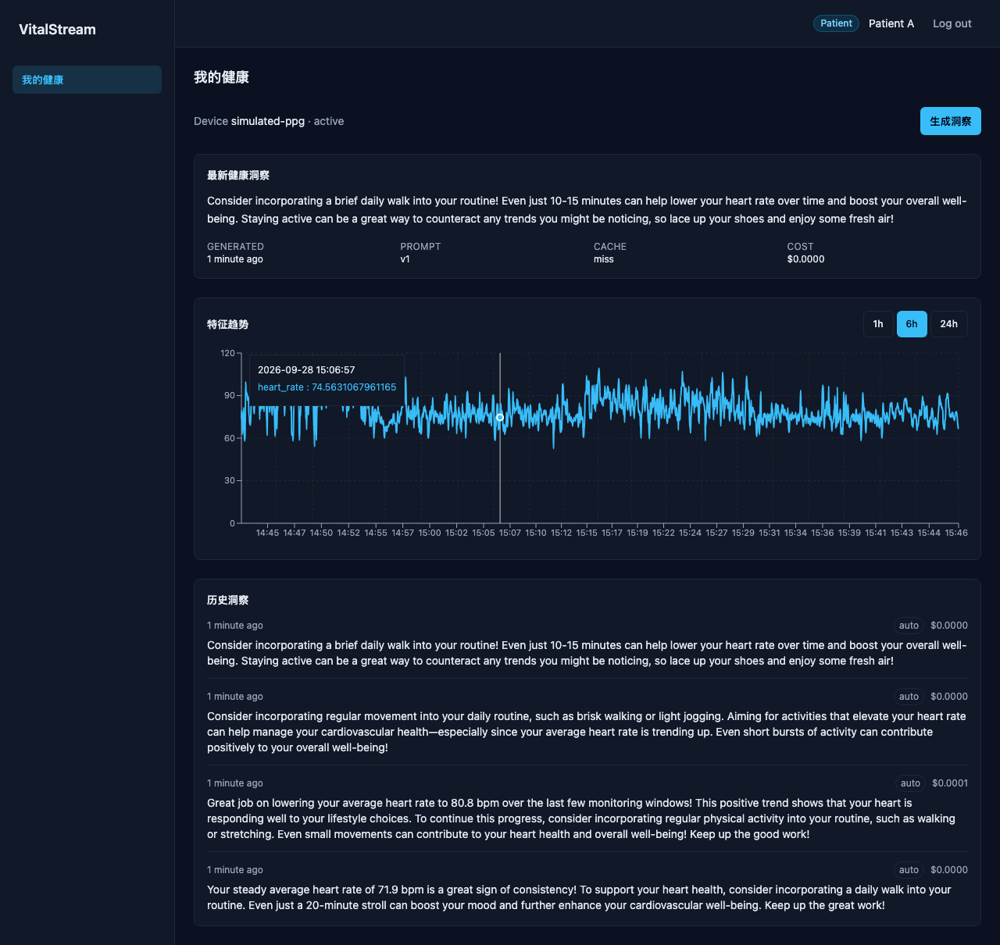
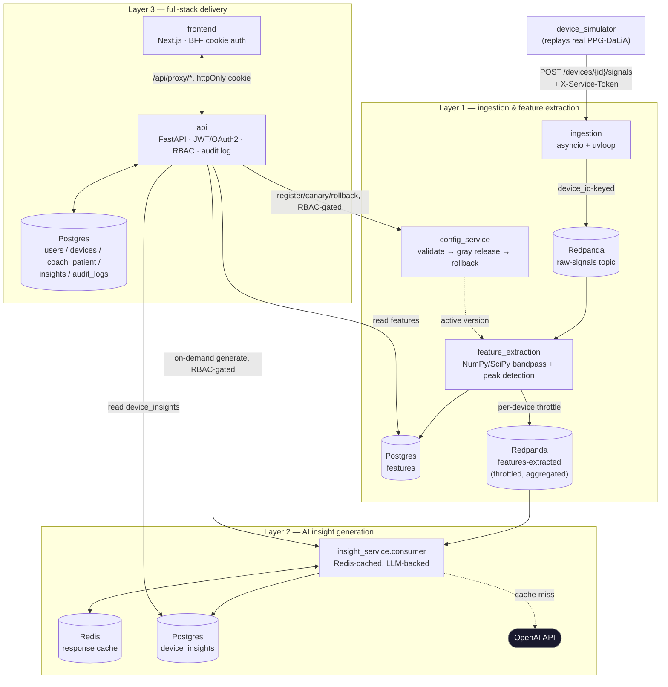
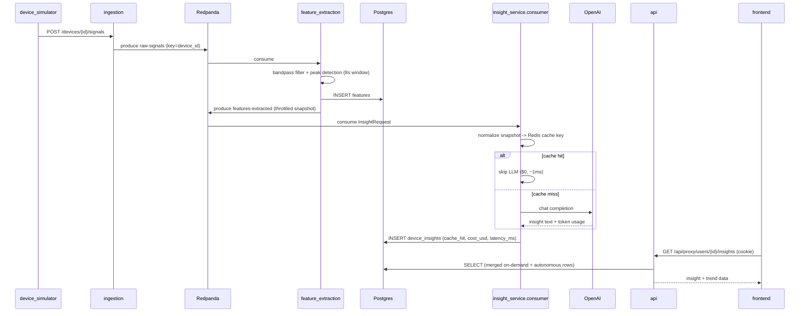
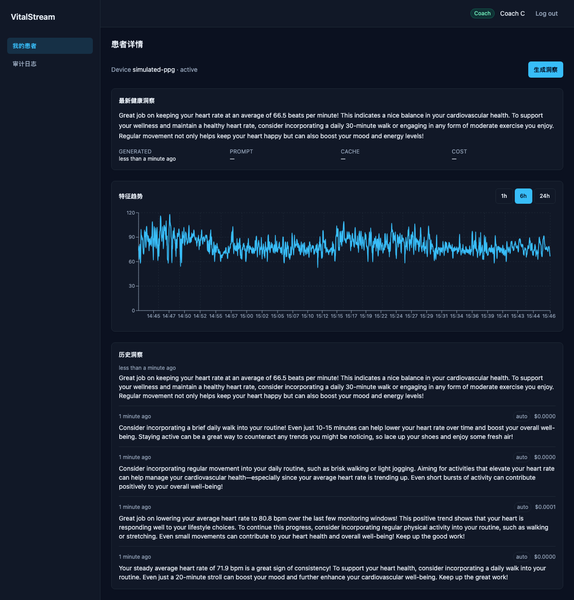
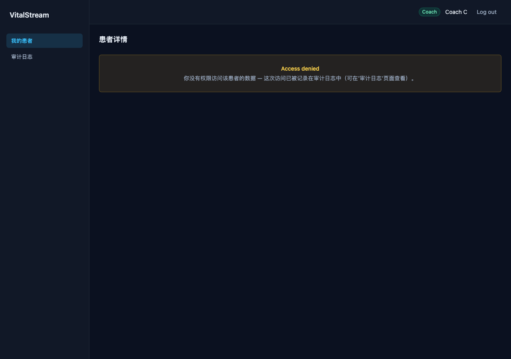
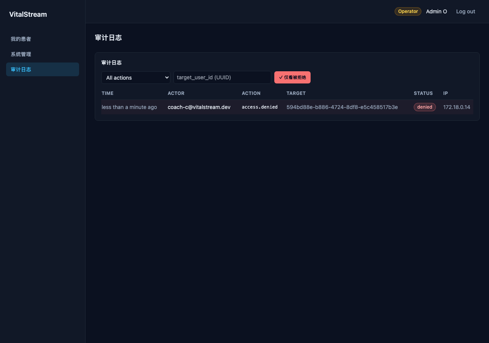
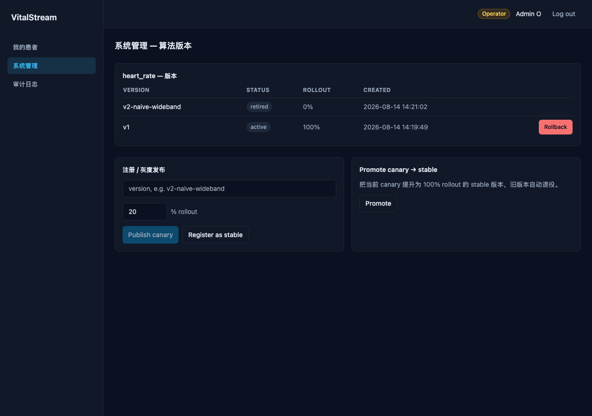

# VitalStream

*A distributed platform that ingests wearable PPG signals over asyncio, extracts
heart-rate features behind a canary-controlled gray-release pipeline, generates
evaluated LLM health insights, and serves them through a JWT/RBAC-secured
FastAPI + Next.js full-stack app — with an audit log for every cross-user access.*

[](https://github.com/AndreaTang123/VitalStream/actions/workflows/ci.yml)
[](https://github.com/AndreaTang123/VitalStream/actions/workflows/release.yml)


Real PPG-DaLiA wearable data in, real OpenAI-generated advice out, real
Postgres-backed accounts and audit trail — every screenshot and number
below is a genuine record (`LLM_MODE=mock` exists solely for load testing
and CI, where hitting real OpenAI would be slow, costly, and nondeterministic
— see [Results](#results) for exactly where it's used and where it isn't).
See [docs/PRD.md](docs/PRD.md) for the full product requirements doc.



## Highlights

- **Load-tested with k6's open-arrival model to a real, found ceiling**:
  500 simulated devices (32,000 samples/sec, real PPG-DaLiA payloads)
  sustained at P99 190.6ms; 1000 breaches the 200ms SLO outright. Kafka
  consumer lag stayed at 0 throughout — `docker stats` + Grafana together
  point the failure squarely at `ingestion`'s single uvicorn worker, not
  the signal-processing pipeline. [Full sweep + bottleneck analysis →](benchmarks/week8_load_test_results.md)
- **A real Grafana dashboard, provisioned as code**, not clicked together —
  fresh `docker compose up` shows live req/s, pipeline latency, cache hit
  rate, and RBAC denials with zero manual setup.
  [Screenshot →](#observability)
- **~4.8x throughput / ~6.5x P50 latency** on the ingestion path from fixing one
  bug (a `send_and_wait()` call that accidentally blocked every HTTP response
  on a Kafka ack) — 384.9 → 1841.8 req/s, P50 25.8ms → 4.0ms, same machine,
  same concurrency. [Full methodology, including three dead ends →](benchmarks/results.md)
- **Hash-bucketed canary releases with one-command rollback** for the feature-
  extraction algorithm — SHA-256(`device_id`) mod 100 against the canary's
  `rollout_pct`, so a device stays on one version for the life of a rollout
  instead of flip-flopping per request.
- **A measured prompt A/B, not a guess**: grounded_rate **18.2% → 95.5%**
  (v1 → v2) on a 22-case hand-written eval set, for a real +32% latency /
  +40% cost trade-off — and the fix that got there wasn't the failure mode
  the project expected going in. [Report →](benchmarks/week5_eval_report.md)
- **LLM response caching whose payoff is measured, not assumed**: 0.2% hit
  rate replaying one continuously-varying device, 56.9% across a 40-device
  fleet resting near the same heart rate — same mechanism, opposite
  conclusion depending on traffic shape.
- **Two-layer RBAC (role + resource) with a real audit trail**, live-verified
  end to end in a browser: a coach reading an authorized patient's data
  succeeds and is logged; reading an unauthorized patient's data by hand-
  editing the URL is cleanly denied *and* the denial itself shows up in the
  audit log's "denied only" filter. [Screenshots below ↓](#interface-screenshots)
- **BFF auth**: access/refresh JWTs live only in httpOnly cookies the browser
  can't read — the Next.js server, not client JS, holds every token.
- **92% test coverage** on the `api` service (101 tests passing across all 7
  Python packages), including a route-sweep meta-test that fails the build
  if any future endpoint forgets its auth dependency.

## Architecture


```mermaid
flowchart TB
    SIM["device_simulator<br/>(replays real PPG-DaLiA)"] -->|"POST /devices/{id}/signals<br/>+ X-Service-Token"| ING

    subgraph L1["Layer 1 — ingestion & feature extraction"]
        ING["ingestion<br/>asyncio + uvloop"]
        KAFKA[("Redpanda<br/>raw-signals topic")]
        FE["feature_extraction<br/>NumPy/SciPy bandpass + peak detection"]
        CFGSVC["config_service<br/>validate → gray release → rollback"]
        PGF[("Postgres<br/>features")]
        KAFKA2[("Redpanda<br/>features-extracted<br/>(throttled, aggregated)")]
    end

    subgraph L2["Layer 2 — AI insight generation"]
        CONSUMER["insight_service.consumer<br/>Redis-cached, LLM-backed"]
        REDIS[("Redis<br/>response cache")]
        PGI[("Postgres<br/>device_insights")]
        LLM(["OpenAI API"])
    end

    subgraph L3["Layer 3 — full-stack delivery"]
        API["api<br/>FastAPI · JWT/OAuth2 · RBAC · audit log"]
        PGA[("Postgres<br/>users / devices / coach_patient /<br/>insights / audit_logs")]
        FRONT["frontend<br/>Next.js · BFF cookie auth"]
    end

    ING -->|device_id-keyed| KAFKA
    KAFKA --> FE
    CFGSVC -. active version .-> FE
    FE --> PGF
    FE -->|per-device throttle| KAFKA2
    KAFKA2 --> CONSUMER
    CONSUMER <--> REDIS
    CONSUMER -.->|cache miss| LLM
    CONSUMER --> PGI

    API <--> PGA
    API -->|on-demand generate, RBAC-gated| CONSUMER
    API -->|read features| PGF
    API -->|read device_insights| PGI
    API -->|register/canary/rollback, RBAC-gated| CFGSVC
    FRONT <-->|"/api/proxy/*, httpOnly cookie"| API

    style LLM fill:#1a1a2e,stroke:#888,color:#fff
```

<details>
<summary>Sequence: one signal's trip from device to screen</summary>


```mermaid
sequenceDiagram
    participant Sim as device_simulator
    participant Ing as ingestion
    participant K as Redpanda
    participant FE as feature_extraction
    participant PG as Postgres
    participant Cons as insight_service.consumer
    participant LLM as OpenAI
    participant API as api
    participant UI as frontend

    Sim->>Ing: POST /devices/{id}/signals
    Ing->>K: produce raw-signals (key=device_id)
    K->>FE: consume
    FE->>FE: bandpass filter + peak detection (8s window)
    FE->>PG: INSERT features
    FE->>K: produce features-extracted (throttled snapshot)
    K->>Cons: consume InsightRequest
    Cons->>Cons: normalize snapshot -> Redis cache key
    alt cache hit
        Cons->>Cons: skip LLM ($0, ~1ms)
    else cache miss
        Cons->>LLM: chat completion
        LLM-->>Cons: insight text + token usage
    end
    Cons->>PG: INSERT device_insights (cache_hit, cost_usd, latency_ms)
    UI->>API: GET /api/proxy/users/{id}/insights (cookie)
    API->>PG: SELECT (merged on-demand + autonomous rows)
    API-->>UI: insight + trend data
```

</details>

Cross-cutting: OpenTelemetry distributed tracing (Jaeger), Prometheus +
Grafana metrics (Week 8), GitHub Actions CI/CD (lint + test + a real-
Postgres migration check + a full-stack Playwright E2E job, images pushed
to GHCR). Everything in the diagram is actually implemented and wired into
`docker-compose.yml` — nothing here is aspirational; see
[Limitations](#limitations--future-work) for what's explicitly *not* built
(TimescaleDB, Kubernetes, Alertmanager routing).

## Results

**k6 device-count sweep** (real PPG-DaLiA payloads, open-arrival-rate load,
`LLM_MODE=mock`; SLO: HTTP P99 < 200ms, error rate < 1%, no Kafka lag growth
— defined *before* the run in `benchmarks/README.md`):

| Devices | Samples/sec | P99 latency | Stable? |
|---|---|---|---|
| 250 | 16,001 | 12.5ms | ✅ |
| **500** | **32,000** | **190.6ms** | ✅ (at the SLO's edge) |
| 1000 | 63,426 | 1,323.9ms | ❌ SLO breached |

**Max stable load on this single-laptop setup: 500 simulated devices
(32,000 samples/sec)**, P99 latency 190.6ms. Kafka consumer lag stayed at
**0 through every tier, including 1000** — ruling out
`feature_extraction`'s signal-processing compute as the cause; `docker
stats` instead shows `ingestion`'s single uvicorn worker process pegged
over 100% CPU at the point of failure, confirming a bottleneck **Week 3's
own report predicted but didn't yet have the load-testing setup to prove**.
[Full sweep, bottleneck analysis, and the Week 3→8 connection →](benchmarks/week8_load_test_results.md)

**Ingestion throughput, before vs. after one fix** (same machine, concurrency=10, 15s, `benchmarks/load_test.py`):

| | RPS | P50 | P95 | P99 |
|---|---|---|---|---|
| Before fix | 384.9 | 25.77 ms | 28.47 ms | 29.79 ms |
| After fix | **1841.8** | **3.96 ms** | 14.82 ms | 27.39 ms |

The fix was replacing a blocking `send_and_wait()` with fire-and-forget
`send()` in the Kafka producer — not uvloop, which measured no benefit on
its own on this workload. [Why, and three benchmarking dead ends along the way →](benchmarks/results.md)

**LLM insight quality, prompt v1 vs v2** (22 hand-written cases, gpt-4o-mini):

| | grounded_rate | hallucination_rate | avg latency | avg cost |
|---|---|---|---|---|
| v1 | 18.2% (4/22) | 4.5% (1/22) | 960.7 ms | $0.000052 |
| v2 | **95.5% (21/22)** | **0.0% (0/22)** | 1272.9 ms | $0.000073 |

v1's real failure mode wasn't hallucination (it was already near-zero) — it
was *groundedness*: 19/22 failures were generic wellness filler that never
restated the actual number it was given. [Full report, including a bug the eval process itself caught →](benchmarks/week5_eval_report.md)

**Redis cache hit rate, by traffic shape** (real replay, real Redis/Postgres):

| scenario | rows | hit rate | cache-hit latency | cache-miss latency |
|---|---|---|---|---|
| One device, full PPG-DaLiA replay | 514 | 0.2% | 0.41 ms | ~977 ms |
| 40 synthetic devices near the same heart rate | 130 | **56.9%** | 0.41 ms | ~977 ms |

Same mechanism, opposite headline number — the cache pays off at fleet
scale, not from one device running longer.

## Key Design Decisions

Seven choices worth defending in an interview, each: what, why, what it costs.

- **k6 for load testing, not Locust — chosen for the open-arrival model,
  not just because it's "another language."** k6's `constant-arrival-rate`
  executor fires N requests/sec regardless of how fast the previous one
  answered; Locust's default is closed-model (wait for a response, then
  send the next), which means a slowing system quietly lowers its own
  offered load and *understates* latency — coordinated omission. "N devices
  each reporting once a second" only means what it says under an open
  model. Cost: one more non-Python tool in the stack, and it's Go, not
  Python — the opposite of this project's "unify on Python" theme, worth
  it specifically because the load generator itself must not become the
  bottleneck it's trying to measure (see [Results](#results) for the
  environment note on why that still isn't fully solved on one laptop).

- **Redpanda + aiokafka, `device_id` as the Kafka message key** (raw-signals,
  features, and features-extracted topics all key by it). Guarantees
  per-device ordering within a partition without a dedicated per-device
  queue. Cost: partition count caps device-level parallelism.
- **Hash-bucketed gray release, not random sampling.** `SHA256(device_id) %
  100 < rollout_pct` routes a device to canary or stable. A given device
  stays on the same version for the life of a rollout (reproducible bugs,
  clean A/B attribution) instead of flip-flopping every request. Cost: a
  slightly uneven real split at small device counts (law of large numbers).
- **Cache key = feature snapshot rounded to 2dp + prompt version + model.**
  Two floating-point-adjacent snapshots (72.001 vs 72.002 bpm) collide on
  purpose. Cost: a cache hit is an *approximation* match, not exact —
  acceptable for wellness copy, not for anything requiring precision.
- **`POST /insights/generate` is synchronous, not a `202`-then-poll queue.**
  It reuses `insight_service`'s Redis cache directly (same machinery the
  autonomous pipeline uses), so a repeat click on an unchanged snapshot is a
  ~1ms cache hit, not a fresh LLM call. Cost: a genuine cache miss blocks the
  HTTP response for the LLM's real latency (~1-2s) — bounded client-side by
  a 60s abort so a stuck call can't hang the button forever.
- **Two-layer RBAC; unauthorized access returns 403, not 404.** Role-level
  (`require_role`) gates *which endpoints* a role can call; resource-level
  (`authorize_user_access`/`authorize_device_access`) gates *which rows*,
  backed by a real `coach_patient` grants table — without it, "coach sees
  their patients" silently degrades into "coach sees everyone." 403 (not a
  404 that disguises "forbidden" as "doesn't exist") was chosen because this
  RBAC serves three *known* internal roles collaborating, not a public API
  defending against user-ID enumeration by strangers.
- **Audit log written synchronously in the same transaction, never queued.**
  These are low-frequency endpoints (config changes, cross-user reads,
  auth events) where a dropped audit row is a compliance problem — unlike
  the data plane, where Kafka's async decoupling is worth the durability
  trade-off.
- **Auth tokens live in httpOnly cookies via a Next.js BFF, never
  `localStorage`.** An XSS payload can read `localStorage`; it can't read an
  httpOnly cookie. Cost: an extra network hop (browser → Next.js → FastAPI)
  and Next.js's server becomes a required component, not an optional static
  shell.

## Quick Start

**Prerequisites**: Docker, Python 3.12, Node 20.

```bash
git clone https://github.com/AndreaTang123/VitalStream.git && cd VitalStream
cp .env.example .env
cp frontend/.env.local.example frontend/.env.local

docker compose up -d                                                      # Postgres, Redpanda, Redis, Jaeger, Prometheus, Grafana
make bootstrap                                                            # create each service's venv
services/api/.venv/bin/alembic -c services/api/alembic.ini upgrade head   # api's schema
services/api/.venv/bin/python -m scripts.seed                             # 4 demo accounts + 2 devices

make frontend-install && make frontend-dev                                # http://localhost:3000
```

`docker compose up -d` also builds and starts every application service
(`ingestion`, `feature_extraction`, `config_service`, `insight_service` +
its Kafka consumer, `api`) — see [docker-compose.yml](docker-compose.yml).
To replay real data through the pipeline, grab a PPG-DaLiA subject
([data/README.md](data/README.md)) and:

```bash
services/device_simulator/.venv/bin/python -m device_simulator.replay --subject S2 \
  --device-id <the S2 device id scripts/seed.py printed> \
  --ingestion-url http://localhost:8001 --service-token <SERVICE_TOKEN from .env>
```

Sign in at **http://localhost:3000/login**:

| Email | Role | Password |
|---|---|---|
| `patient-a@vitalstream.dev` | patient | `password123` |
| `patient-b@vitalstream.dev` | patient | `password123` |
| `coach-c@vitalstream.dev` (authorized for patient A only) | coach | `password123` |
| `admin-o@vitalstream.dev` | admin/operator | `password123` |

Other useful addresses once everything's up: `api` docs at
[localhost:8000/docs](http://localhost:8000/docs), Jaeger traces at
[localhost:16686](http://localhost:16686), Grafana at
[localhost:3001](http://localhost:3001) (scrape targets not wired yet — see
[Limitations](#limitations--future-work)).

## Interface Screenshots

All captured against the real running stack — every number and sentence is
a genuine record, not mocked.


*Coach C viewing authorized patient A — the exact same dashboard component
patient A sees on their own login, just parameterized by `userId`.*


*Coach C hand-editing the URL to patient B's id — cleanly denied by
resource-level RBAC.*


*The access attempt above, found by the admin filtering the audit log to
"denied only" — actor, action, target, and source IP all legible.*


*`heart_rate`'s real version history from gray-release testing — `v1`
active, `v2-naive-wideband` retired via rollback.*

## Observability

`docker compose up -d` includes Jaeger — UI at
[localhost:16686](http://localhost:16686). `ingestion` and
`feature_extraction` both export spans via OTLP/HTTP, and they're *one
trace* across two processes: `ingestion` injects the current span's W3C
trace context into the outgoing Kafka message headers, and
`feature_extraction`'s consumer loop extracts it back out and continues the
same trace instead of starting a new one:

```
POST /api/v1/devices/{id}/signals   (ingestion, HTTP)
└─ consume raw-signal               (feature_extraction, Kafka)
   ├─ compute feature (bandpass+peaks)
   ├─ produce features-topic
   └─ write features row (postgres)
```

**Metrics are real as of Week 8** — `docker compose up -d` brings up
Grafana at [localhost:3001](http://localhost:3001) (anonymous viewer
access, no login needed) with one dashboard, provisioned as code
(`infra/grafana/provisioning/`), auto-loaded on every fresh start:


Four rows: **Ingestion** (req/s, samples/s, HTTP P50/P95/P99, error rate),
**Pipeline** (Kafka consumer lag, end-to-end latency ingest→Postgres,
feature windows/sec *by `algo_version`* — a gray-release rollout made
visible as two lines whose ratio tracks `rollout_pct`, and one line
dropping to zero on rollback), **AI** (cache hit rate, LLM latency,
cumulative real spend), **Platform** (api error rate, RBAC denials/hour by
action, service `up`). Screenshot above is from a real 50-device load-test
run — see [Results](#results) for what the numbers mean.

Three Prometheus alert rules (`infra/prometheus/alerts.yml`) — growing
consumer lag, high error rate, P99-over-SLO — fire in Prometheus's own
Alerts UI ([localhost:9090/alerts](http://localhost:9090/alerts)); not
wired to Alertmanager/Slack, which was explicitly out of scope this week
(see [Limitations](#limitations--future-work)).

**Where each metric comes from**: `ingestion` and `api` get the generic
`http_request_duration_seconds` histogram for free from
`prometheus-fastapi-instrumentator`, plus a couple of hand-added business
counters (`ingest_samples_total`, `authz_denied_total`) that a generic HTTP
histogram can't express. `feature_extraction` and
`insight_service.consumer` have no HTTP server of their own (they're Kafka
consumer loops) — each runs its own standalone metrics server
(`prometheus_client.start_http_server`, ports 9101/9102). No metric anywhere
is labeled by `device_id`/`user_id`/`actor_id` — with a 1000-device load
test that's thousands of time series per histogram bucket, the exact
cardinality blowup that makes Prometheus fall over; device-level detail
belongs in Postgres, not here.

## Security

RBAC and auth are covered in depth under [Deep Dives](#deep-dives) below.
The baseline checklist, walked and checked off against the real code:

- [x] `JWT_SECRET_KEY`/`SERVICE_TOKEN` come from environment variables;
      `.env` is gitignored, no real secret is committed.
- [x] Token decode pins an explicit algorithm allowlist
      (`algorithms=[settings.jwt_algorithm]`) — rejects forged `alg: none`
      tokens; `exp` is checked automatically.
- [x] Access tokens expire in 30 minutes; refresh tokens (7 days) are
      revocable via a `refresh_tokens` table — a bare stateless JWT can't be.
- [x] Passwords hashed with bcrypt; login returns an identical error for
      "no such user" and "wrong password" (no user enumeration).
- [x] Every non-public route carries an auth dependency — enforced by a
      test that walks `app.routes`, not a manual audit
      (`tests/test_route_auth.py`).
- [x] CORS allows only `http://localhost:3000`, never `["*"]`.
- [x] Login has basic rate limiting (in-process fixed window — a
      single-instance deployment doesn't need Redis for this).
- [x] Responses use dedicated `UserOut`/`DeviceOut` Pydantic models — ORM
      objects (and `hashed_password`) are never serialized directly.
- [x] All database access is parameterized; the one raw-SQL query
      (`routers/features.py`, needed because that table belongs to a
      different service's schema) uses SQLAlchemy `text()` with named,
      explicitly-typed bind parameters, never f-string interpolation.
- [x] Auth tokens live only in httpOnly cookies (BFF pattern) — never
      `localStorage`, never readable by an XSS payload.

## Testing & CI

- **101 tests passing** across 7 Python packages (`make test`); `api`
  alone is ~92% statement coverage (`pytest --cov`, tracked in CI —
  `.github/workflows/ci.yml` uploads it as a build artifact every run).
- The permission matrix is the highest-value suite:
  `services/api/tests/test_rbac.py` parametrizes 3 roles × own/authorized/
  unauthorized across the read endpoints; `test_route_auth.py` is a
  structural sweep that fails the build if a future endpoint forgets its
  auth dependency; `test_audit.py` asserts cross-user reads *do* write an
  audit row and self-reads *don't*; `test_llm_mock_mode.py` asserts
  `LLM_MODE=mock` never touches the real OpenAI client — a load test or CI
  run silently making real API calls would be a much worse bug than a
  failing test.
- **CI is three jobs**, not one (`.github/workflows/ci.yml`):
  - `python-services` — lint + pytest per package, `LLM_MODE=mock`
    throughout, coverage uploaded for `api`.
  - `db-migrations` — `alembic upgrade head` against a **real** Postgres
    service container, not sqlite. This is the job that would have caught
    every Postgres-only bug this week's live-verification pass found by
    hand (StrEnum value mismatch, a reserved-word column name, asyncpg
    type-inference failures) — see [Results](#results) and the Week 8
    entry in git log for the full list. Sqlite-backed unit tests structurally
    cannot catch this class of bug; only a real Postgres in CI can.
  - `e2e` — the full stack via `docker compose ... --wait` (every service
    now has a real healthcheck, not just "container started"), migrated,
    seeded, then the 4 Playwright specs (`frontend/e2e/`) against it.
- **CD** (`.github/workflows/release.yml`) builds and pushes all 6
  application images to GHCR on every push to `main` and on `v*` tags.
  `docker-compose.prod.yml` is the "any VM with Docker" deploy story this
  project stops at — deliberately no Kubernetes (see
  [Limitations](#limitations--future-work)).

## Project Structure

```
services/
  ingestion/           Layer 1 — asyncio + uvloop signal ingestion, produces to Redpanda
  feature_extraction/  Layer 1 — NumPy/SciPy windowed feature extraction, gray-release aware
  config_service/      Layer 1 — versioned config: validate / gray release / rollback
  device_simulator/    Replays a real PPG-DaLiA subject against the ingestion API
  insight_service/     Layer 2 — LLM insight generation: on-demand HTTP + autonomous Kafka consumer, caching, eval, A/B testing
  api/                 Layer 3 — FastAPI backend: OAuth2/JWT auth, two-layer RBAC, audit log, Alembic migrations
libs/common/           Shared Pydantic schemas + telemetry helpers used across services
frontend/              Layer 3 — Next.js dashboard: BFF cookie auth, patient/coach/operator views
scripts/               scripts/seed.py — demo accounts/devices/coach grants (+ --load-devices for k6)
loadtest/              k6 script, real-PPG payload prep, tiered runner (Week 8)
infra/                 Prometheus/Grafana provisioning (dashboards + alerts as code), cloud VM bootstrap
benchmarks/            Real measured results — throughput, eval, cache, load test (week8_load_test_results.md)
data/                  Dataset download script + local data cache (gitignored)
docs/                  PRD, architecture notes, screenshots
```

`docker-compose.loadtest.yml` and `docker-compose.prod.yml` are override
files, not standalone stacks — see [Quick Start](#quick-start) and
[Results](#results) for how each is actually invoked.

## Limitations & Future Work

Scoped out deliberately, per [PRD §2.2](docs/PRD.md) and §10 — listed here
instead of left implicit, because knowing what's *not* built is as much a
signal of engineering judgment as what is:

- **No medical-grade accuracy claim.** Generated advice is general
  lifestyle text, not clinical guidance — the PRD is explicit about this.
- **No real device or hospital data.** Every signal replayed is from public
  research datasets (PPG-DaLiA), never a real patient.
- **No production HA.** Single-instance deployment (single uvicorn worker
  per service, not swept as a variable this week — see
  [Results](#results)); the in-process rate limiter and refresh-token
  single-flight both assume one process.
- **No TimescaleDB.** Raw/derived signals live in plain Postgres; at this
  project's data volume, a hypertable would be premature optimization.
- **No Kubernetes / cloud deploy pipeline.** Week 8's CD stops at "push
  images to GHCR" + a `docker-compose.prod.yml` for a single VM — a
  deliberate scope cut (see that section's own comment for why).
- **Alerts fire in Prometheus's UI only** — not wired to Alertmanager/
  Slack/email. Three rules exist (`infra/prometheus/alerts.yml`); routing
  them anywhere was out of this week's scope.
- **No OpenAPI type-drift check in CI.** `frontend/lib/api-types.ts` is
  still hand-written (Week 7), not generated — a drift check comparing it
  against a generated file would fail immediately and for the wrong
  reason. Worth adding once that file is actually generated from a live
  `api` build, not before.
- **The load test ran on a single laptop that was also running k6
  itself** — not a separate load-generator host. Every number in
  [Results](#results) is a conservative floor because of that, not a
  clean isolated measurement; `benchmarks/README.md` says so explicitly
  rather than presenting it as more rigorous than it is.
- **HIPAA/GDPR**: only the *engineering practices* associated with
  compliance (audit logging, RBAC, encrypted-in-transit auth) are
  implemented — this is not a certified-compliant system.

## Deep Dives

Longer mechanism write-ups, for anyone who wants the "why" behind a specific
piece rather than the summary above.

<details>
<summary><strong>Gray release mechanics (config_service)</strong></summary>

`config_service` owns algorithm version state in Postgres (`algo_versions` +
`algo_version_audit` — every register/canary/promote/rollback call is
audited with an actor, action, and timestamp) and exposes it over HTTP.
`feature_extraction` polls `GET .../active` into an in-memory cache every
30s (`CONFIG_REFRESH_INTERVAL_SECONDS`) rather than on every message, and
routes each device to a version by hashing its `device_id` mod 100 against
the canary's `rollout_pct`.

```bash
# register the first stable version
curl -X POST localhost:8002/api/v1/config/feature-algo/register-stable \
  -d '{"algo_name":"heart_rate","version":"v1","actor":"you"}'

# gray-release a second version to 20% of devices
curl -X POST localhost:8002/api/v1/config/feature-algo \
  -d '{"algo_name":"heart_rate","version":"v2-naive-wideband","rollout_pct":20,"actor":"you"}'

# looks good? promote it to 100%
curl -X POST localhost:8002/api/v1/config/feature-algo/heart_rate/promote -d '{"actor":"you"}'

# looks bad? roll it back — works whether it's still a canary or already
# promoted to active (restores the previous version in the latter case)
curl -X POST localhost:8002/api/v1/config/feature-algo/heart_rate/v2-naive-wideband/rollback -d '{"actor":"you"}'

# who did what, when
curl localhost:8002/api/v1/config/feature-algo/heart_rate/audit-log
```

`features.HEART_RATE_ALGORITHMS` maps a version string to an actual
implementation — `v1` is the tuned algorithm, `v2-naive-wideband` is a real
(not synthetic) bad version: the pre-tuning parameters that scored ~37 bpm
MAE in `validate_ppg_dalia.py` before being fixed to ~8 bpm. Publishing it
as a canary and rolling it back is a genuine "ship a regression, catch it,
revert it" exercise, not a no-op toggle. Live-verified: a 20% canary landed
in exactly 20/100 devices' feature rows, and rollback dropped that to 0/100
within one 30s cache-refresh cycle.

</details>

<details>
<summary><strong>Insights pipeline mechanics (insight_service)</strong></summary>

`feature_extraction` throttles each device to at most one `InsightRequest`
per `insight_throttle_seconds` (default 60s), aggregating the last 5
windows into a snapshot (`heart_rate_mean`/`heart_rate_trend`) rather than
firing an LLM call per 8-second window. Published to `features-extracted`
(Kafka), never polled from Postgres directly.

`insight_service.consumer` (distinct from `.main`'s user-triggered,
RBAC-gated `/insights/generate` HTTP endpoint — that one persists to `api`'s
own `insights` table; this one is autonomous and owns `device_insights`)
does, per request: normalize the snapshot to a Redis cache key (rounded to
2 decimal places + prompt/model version) → on a hit, skip the LLM entirely;
on a miss, call OpenAI (one retry, 15s timeout, failures logged and skipped
rather than crashing the consumer), computing real cost from
`usage.prompt_tokens`/`completion_tokens` against a static price table
(`insight_service/pricing.py`) → persist the `DeviceInsight` either way,
`cache_hit`/`latency_ms`/`cost_usd` included.

```bash
services/insight_service/.venv/bin/python -m insight_service.eval.cache_savings --limit 200
services/insight_service/.venv/bin/python -m insight_service.eval.run_benchmark --prompt-version v1 --model gpt-4o-mini
services/insight_service/.venv/bin/python -m insight_service.eval.run_benchmark --prompt-version v2 --model gpt-4o-mini
```

`benchmarks/cases.yaml` (22 hand-written cases, 4 categories) each carry
human-written `checks` describing what a grounded, safe response should
do — not full expected-output text, since exact-matching LLM output isn't
realistic. `insight_service.eval.judge` scores two dimensions:
`check_grounded` is rule-based (does the described trend direction match
the data, does the text cite an actual number) — no LLM needed for that
half; `check_hallucination` calls an LLM judge with a strict yes/no + reason
prompt; a judge failure scores as unscored (`None`), never a silent "no
hallucination found."

</details>

<details>
<summary><strong>RBAC & audit log design (api)</strong></summary>

**Roles**: `patient` (own data only), `coach` (only patients explicitly
granted via `coach_patient`), `admin` (platform operator — the PRD's
"operator" concept, one name in code).

**Two RBAC layers**:
1. **Role-level** (`api/rbac.py: require_role`) — coarse endpoint gating,
   e.g. `POST /config/feature-algo` requires `admin`.
2. **Resource-level** (`api/deps.py: authorize_user_access` /
   `authorize_device_access`) — within a role, *which* rows. Backed by the
   database's actual ownership (`devices.user_id`, `coach_patient` grants),
   never trusting a JWT payload or path parameter's claimed id.

**Audit log** (`api/audit.py`) only records what PRD §5.3 actually asks
for — cross-user health data reads (`insights.read`/`features.read`, only
when `actor.id != target_user_id`), config mutations
(`config.publish_canary`/`config.rollback`), auth events
(`auth.login_success`/`auth.login_failed`), and every resource-level
authorization denial (`status='denied'`). Self-reads are never logged — a
blanket request log would bury the "who looked at whose data" signal in
noise. Written synchronously in the same transaction as the action, not
queued: these endpoints are low-frequency, and a dropped audit row is a
compliance problem.

`GET /audit-logs` is itself access-controlled: a `coach` sees only records
they triggered or that target their granted patients; only `admin` sees
everything — an unguarded audit endpoint is one of the most common and
most ironic RBAC holes.

**Alembic boundary**: `services/api/migrations` manages only `api`'s own
tables (`users`/`devices`/`coach_patient`/`insights`/`refresh_tokens`/
`audit_logs`). `features` (feature_extraction-owned) and `device_insights`
(insight_service-owned) share the same physical Postgres instance but keep
their own service-managed schema — `api` reads them with read-only raw SQL,
never with an Alembic-managed foreign key. This cross-service-shared-DB,
separately-owned-schema boundary was set in Week 1 and deliberately held
here rather than blurred for convenience.

**Reproducing the RBAC + audit claims by hand:**

```bash
# 1. log in (any scripts/seed.py account, password123 for all)
curl -s -X POST localhost:8000/api/v1/auth/login \
  -d "username=patient-a@vitalstream.dev&password=password123" | tee /tmp/login.json
ACCESS=$(python3 -c "import json;print(json.load(open('/tmp/login.json'))['access_token'])")

# 2. read your own insights (real data, not mock)
curl -s localhost:8000/api/v1/users/<patient-a-id>/insights -H "Authorization: Bearer $ACCESS"

# 3. try another patient's data -> 403
curl -s -o /dev/null -w "%{http_code}\n" localhost:8000/api/v1/users/<patient-b-id>/insights \
  -H "Authorization: Bearer $ACCESS"

# 4. as the authorized coach, read patient A, then check the audit trail
curl -s -X POST localhost:8000/api/v1/auth/login \
  -d "username=coach-c@vitalstream.dev&password=password123" | tee /tmp/coach.json
COACH_ACCESS=$(python3 -c "import json;print(json.load(open('/tmp/coach.json'))['access_token'])")
curl -s localhost:8000/api/v1/users/<patient-a-id>/insights -H "Authorization: Bearer $COACH_ACCESS"
curl -s localhost:8000/api/v1/audit-logs -H "Authorization: Bearer $COACH_ACCESS"
```

</details>

<details>
<summary><strong>Frontend BFF architecture (frontend)</strong></summary>

`frontend/` is a Next.js 14 App Router app — Tailwind (hand-rolled UI
primitives in `components/ui/` rather than shadcn/ui, whose CLI pulls
component source from a network registry at generation time), TanStack
Query for all server-state fetching/caching/polling, Recharts for the trend
chart.

```
browser  ──(same-origin, cookie rides along)──▶  Next.js Route Handlers  ──(Authorization: Bearer)──▶  api
           /api/auth/{login,logout,me}
           /api/proxy/[...path]  (everything else)
```

- `POST /api/auth/login` forwards to FastAPI, writes the returned
  access/refresh tokens into **httpOnly** cookies, and returns only
  `{id, email, role, display_name}` to the browser.
- `GET/POST /api/proxy/[...path]` is the one door every client component
  knocks on for data. It reads the access-token cookie, adds
  `Authorization`, forwards to `api`. A `401` triggers one single-flight
  refresh (a module-scope in-flight promise, so five widgets 401-ing at
  once produce one refresh call, not five racing ones) and a retry; a `403`
  passes straight through — conflating "stale token" with "no access" would
  retry-loop a permission denial forever.
- `middleware.ts` redirects a logged-out visitor away from protected routes
  before the page renders, and `components/RoleGate.tsx` shows a clean
  "Access denied" instead of a page full of 403'd widgets when a role
  doesn't match a route. **Neither is a security boundary** — the real
  authorization decision is made exactly once, in FastAPI; a request that
  bypassed the frontend entirely (raw curl) gets the same answer.
- `POST /insights/generate` is awaited directly rather than polled — see
  [Key Design Decisions](#key-design-decisions) — with a 60s client-side
  abort so a stuck LLM call can't hang the button forever.

</details>

## Dataset & License

Wearable signals are replayed from **PPG-DaLiA** (Reiss et al.), hosted on
the [UCI Machine Learning Repository](https://archive.ics.uci.edu/) — a
public research dataset, not proprietary or personal data. See its UCI page
for citation details and usage terms; the dataset itself is not committed
to this repo (`data/raw/` is gitignored) — `data/scripts/download_datasets.sh`
fetches it directly.

This repository has no LICENSE file yet — it's a personal portfolio/job-
search project (see [docs/PRD.md §1.4](docs/PRD.md)), not currently
distributed under an open-source license.
