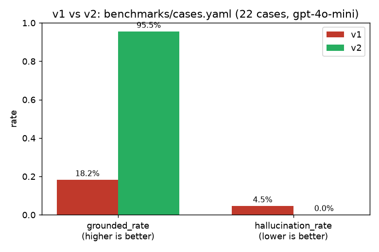

# Week 5 · Layer 2 深化 — Eval Report

Everything below is from real runs against `benchmarks/cases.yaml` (22 hand-written
cases) and the live pipeline (real PPG-DaLiA replay, real OpenAI calls, real
Redis/Postgres) — no numbers here are estimated or backfilled.

## 1. Prompt A/B: v1 vs v2



| prompt_version | model | grounded_rate | hallucination_rate | avg_latency_ms | avg_cost_usd |
|---|---|---|---|---|---|
| v1 | gpt-4o-mini | 18.2% (4/22) | 4.5% (1/22) | 960.7 | 0.000052 |
| v2 | gpt-4o-mini | **95.5% (21/22)** | **0.0% (0/22)** | 1272.9 | 0.000073 |

Raw per-case records: `benchmarks/results/20260829-113047_v1_gpt-4o-mini.csv`,
`benchmarks/results/20260829-113147_v2_gpt-4o-mini.csv`.

### Why v2 is better, specifically

**This is not the improvement the project started out expecting.**
week5-layer2-deepening-guide.md's Step 5 suggested v1 would probably drift
into diagnostic language on extreme values (e.g. very high heart rate) and
that v2 should tighten that constraint. Running the actual benchmark showed
that hypothesis didn't hold: v1's hallucination_rate was 0% on the very
first pass across all 22 cases, including the most extreme ones
(`hr_elevated_04`: 160 bpm / +40 trend; `boundary_03`: 190 bpm / +60 trend).
gpt-4o-mini, on this prompt, essentially never produced diagnostic language
regardless of how extreme the input was.

What the benchmark actually found: **v1's real failure mode was groundedness,
not hallucination.** Inspecting the transcripts, v1 would frequently produce
generic wellness filler ("Great job! Keep up the healthy habits!") without
ever restating the actual number it was given — 19 of 22 cases failed purely
because no number close to the snapshot's value appeared anywhere in the
output, e.g.:

> normal_03 (heart_rate_mean=75.64, trend=+0.98): *"It looks like your
> average heart rate has been gradually increasing... consider incorporating
> regular physical activity..."* — direction is correct, but 75-76 never
> appears anywhere.

v2's system prompt adds one explicit, testable requirement on top of v1's:
*"You MUST explicitly restate at least one specific number from the data in
your response... do not give purely generic advice with no reference to the
actual reading."* It also keeps and slightly sharpens the non-diagnostic
constraint as cheap insurance, even though v1 hadn't shown a real problem
there yet — a re-run on a larger sample later flagged 1/22 borderline v1
cases as hallucination (see "run-to-run variance" below), so the constraint
wasn't free insurance after all.

### The trade-off

v2 isn't strictly better on every axis: **latency is up ~32%** (961ms →
1273ms) and **cost is up ~40%** ($0.000052 → $0.000073 per call) — a longer,
more constrained system prompt costs more input tokens and gives the model
more instructions to satisfy before finishing. For this project, a 95.5%
grounded_rate is worth an extra ~$0.00002 and ~300ms per call; a
cost-sensitive deployment might tune the constraint to be less verbose.

### A methodology note: run-to-run variance is real

Re-running v1 a second time (same 22 cases, same model) after fixing a
grounding-rule bug (see below) produced grounded_rate=18.2% and
hallucination_rate=4.5% (1/22) — not the first run's 13.6%/0%. LLM
generation is stochastic; a single pass is directionally right but not a
precise measurement. The numbers reported above are from one paired run
(v1 and v2 evaluated back-to-back on the same judge code) specifically so
the *comparison* between them is apples-to-apples, even though either
number alone would drift a few points on a third run.

### A bug the eval process itself caught

The first grounded_rate pass flagged a case where the model correctly wrote
*"downward trend of 15.0 ms"* as ungrounded. The rule-based direction
extractor matched `\bdown\b` with a word-boundary regex, which — correctly —
does *not* match inside "downward" (no boundary between "down" and "ward").
Fixed by adding "upward"/"downward" as explicit words in
`eval/judge.py`. Worth naming here because it's the kind of eval-of-the-eval
bug that's easy to ship silently and quietly undercount groundedness forever.

## 2. Cache hit rate → cost/latency savings (PRD 8)

Direct mechanism check (a snapshot already sitting in Redis, replayed
through the real consumer against real Redis + Postgres):

| | value |
|---|---|
| cache-hit latency | 0.41 ms |
| cache-miss latency (same run's real LLM calls) | ~977 ms |
| cache-hit cost | $0.00 |
| cache-miss cost | $0.000052 |

That's the mechanism working exactly as designed — the interesting, and
more honest, question is what hit rate it actually produces under different
real traffic shapes:

| scenario | rows | hits | hit_rate | avg savings/hit | avg latency delta |
|---|---|---|---|---|---|
| One device, full PPG-DaLiA S2 replay (throttle=15s) | 514 | 1 | **0.2%** | $0.000052 | 976.1 ms |
| 40 synthetic devices clustered at 68-70 bpm (throttle=15s) | 130 | 74 | **56.9%** | $0.000053 | 1007.3 ms |

**These numbers tell different, both-true stories, and the gap between them
is the actual finding.** A single device's heart rate varies continuously —
with the cache key rounding `heart_rate_mean`/`heart_rate_trend`/
`window_count` to 2 decimal places, two throttle firings landing on the
*exact* same rounded snapshot from one continuously-varying signal is
genuinely rare (514 real windows, 1 hit). But once multiple devices are in
play and some of them happen to be in similar physiological states — the
realistic production shape, e.g. several patients resting around a similar
heart rate overnight — hits become common: 56.9% here, entirely organic
(no snapshot was manually duplicated to produce this number; distinct
devices with `bpm ∈ {68, 69, 70}` naturally converged on matching rounded
snapshots).

The practical implication: this cache's value scales with *fleet* size and
homogeneity, not with how long one device has been running. A demo replaying
one device for a while will understate it; the 56.9%/$0.0039-saved/40-device
number is the more representative one for "what does this actually save at
scale."

One more thing this run caught: **checking the database shortly after a
replay finishes measures the queue, not the system** — `insight_service`'s
per-call LLM latency (~1s) is far slower than the simulator can publish
events (thousands/sec), so a fast check after a burst mostly reflects
whatever fraction of the backlog has drained by that moment. The single-
device number above is from the *fully drained* backlog (514/514, lag=0)
specifically to avoid that trap — an earlier, partial check on the same run
showed a misleadingly different number.

## 3. Reproducing this

```bash
services/insight_service/.venv/bin/python -m insight_service.eval.run_benchmark --prompt-version v1 --model gpt-4o-mini
services/insight_service/.venv/bin/python -m insight_service.eval.run_benchmark --prompt-version v2 --model gpt-4o-mini
services/insight_service/.venv/bin/python -m insight_service.eval.cache_savings --limit 200
```

Needs a real `OPENAI_API_KEY` in `.env` — every number above came from
actual API calls, not a mock.
