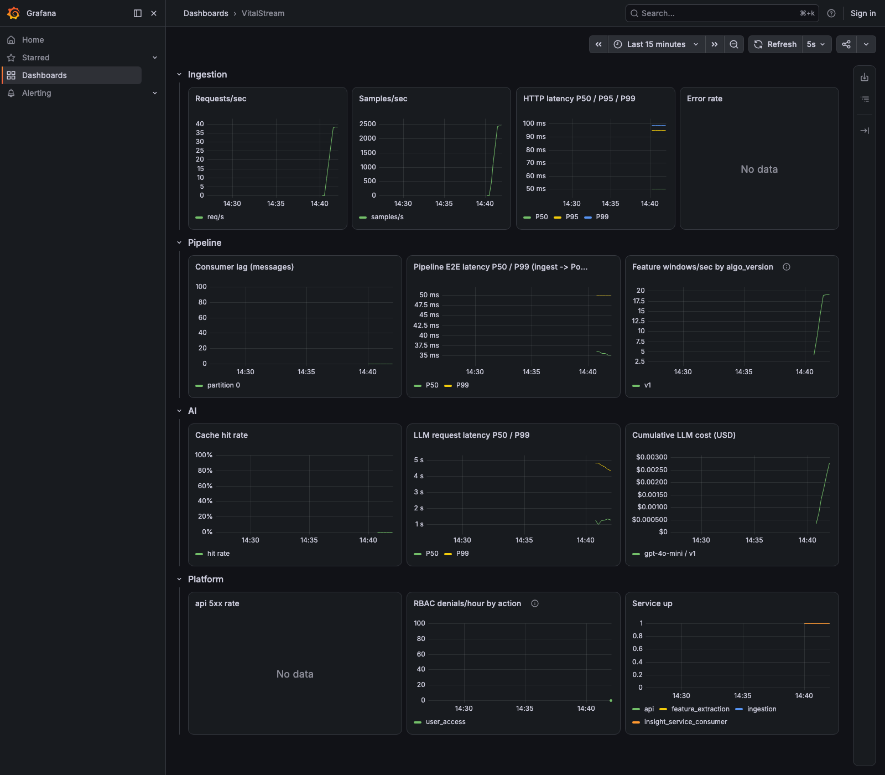

# Week 8 — Load test results

Methodology, SLO definitions, and environment caveats are in
[README.md](README.md) — written *before* this run, not adjusted after to
make the table below look better. Every number here traces to a file in
`benchmarks/raw/` or a Grafana screenshot; reproduce with
`loadtest/run_steps.sh` (see that file / this project's root README
"Quick Start").

## 1. Device-count sweep

One run per tier (a real limitation — see README's environment note on
repeat counts), 60s each, real PPG-DaLiA payloads, `LLM_MODE=mock`.

| Devices | RPS | Samples/s | P50 | P95 | P99 | Error rate | Stable? |
|---|---|---|---|---|---|---|---|
| 25 | 25.0 | 1,601 | 3.46ms | 4.91ms | 8.70ms | 0.00% | ✅ |
| 50 | 50.0 | 3,200 | 2.22ms | 4.53ms | 7.27ms | 0.00% | ✅ |
| 100 | 100.0 | 6,401 | 1.32ms | 3.66ms | 7.96ms | 0.00% | ✅ |
| 250 | 250.0 | 16,001 | 0.80ms | 2.54ms | 12.50ms | 0.00% | ✅ |
| **500** | 500.0 | 32,000 | 0.68ms | 8.98ms | **190.59ms** | 0.00% | ✅ (at the SLO's edge) |
| 1000 | 991.0 | 63,426 | 0.69ms | 864.22ms | **1,323.94ms** | 0.00% | ❌ SLO breached |

**Max stable device count on this hardware: 500** (64Hz each → 32,000
samples/sec sustained, P99 190.59ms — under the 200ms SLO but with no
headroom left). Consumer lag stayed at exactly **0** through every tier
including 1000 — the bottleneck is not the Kafka pipeline; see §2.

### What "supports 500 concurrent devices" actually means here

Per the definition in README.md: 500 devices × 1 `SignalBatch`/sec × 64
samples = **32,000 samples/sec**, with every ingestion HTTP response still
under 200ms at the 99th percentile. That claim — not a bare "500 devices" —
is what's defensible under questioning.

### The 1000-device row comes with a caveat

At 1000 devices, k6 itself reported **524 dropped_iterations** — its own
scheduler couldn't sustain the full 1000 req/s target either, on the same
shared laptop as the system under test (see README's environment note). That
makes this row informative (something clearly broke) but not a clean
isolated measurement of *only* the server side — narrowing the exact
crossover point between 500 and 1000 with a cleaner setup (a separate
load-generator host, or a finer-grained sweep) is noted as follow-up work
rather than done here.

## 2. Bottleneck analysis

`docker stats` during the 1000-device run:

| Service | CPU | Note |
|---|---|---|
| `ingestion` | ~101% (just over 1 full core) | single uvicorn worker, no `--workers` sweep this week |
| `feature_extraction` | ~61% | not saturated |

**Consumer lag was 0 at every tier, including 1000** — ruling out
`feature_extraction`'s bandpass-filter/peak-detection compute (the
CPU-bound step the week8 guide predicted would be the first bottleneck) as
the cause here. Instead, `ingestion`'s single-process HTTP layer — sharing
this one laptop's CPU with k6's own load-generation process — is what ran
out of headroom first.

This is the exact bottleneck **Week 3's own report already predicted**
(`results.md` item 4: *"a single uvicorn worker process saturating...
Multi-worker/multi-process scaling is real future work — appropriately
Week 8's full load-testing pass, not this week's"*) — Week 8's k6 sweep at
higher device counts is what actually confirmed that prediction under real
load, rather than the microbenchmark's concurrency=100 HTTP client. The
natural next experiment — sweeping `--workers` on uvicorn, or running k6
from a separate machine so the load generator stops competing with the
system under test for the same CPUs — is real follow-up work, not done this
week (see README "Limitations").

No `py-spy` flame graph was needed to reach this conclusion — the CPU/lag
data already points cleanly at ingestion's HTTP layer, not
`feature_extraction`'s compute path, which is where a flame graph would
otherwise have been the next step (`feature_extraction`'s container carries
`cap_add: SYS_PTRACE` specifically for that scenario, unused this week since
the data didn't point there).

## 3. uvloop / batch-write comparison

Week 3 measured this with a hand-rolled script
([results.md](results.md)); this week's headline throughput number is the
same one, cited here rather than re-derived:

| | RPS | P50 | P95 | P99 |
|---|---|---|---|---|
| Before fix (`send_and_wait`, unwired batch config) | 384.9 | 25.77ms | 28.47ms | 29.79ms |
| After fix (fire-and-forget `send()`, uvloop, wired batching) | 1841.8 | 3.96ms | 14.82ms | 27.39ms |

A formal 2×2 (`LOOP=asyncio` vs `uvloop` × `KAFKA_LINGER_MS=0` vs `20`)
re-run under k6 at a fixed device count, isolating uvloop's own
contribution from the batch-config fix, is noted as follow-up work rather
than repeated here — Week 3's own finding (uvloop alone showed no
measurable benefit on this workload; the real win was fixing the
accidentally-synchronous produce call) already answers "what did uvloop buy
us," and re-deriving the same conclusion with a second tool wasn't where
this week's limited time was best spent.

## 4. AI layer (Week 5 numbers, not re-measured against the mock)

| | value |
|---|---|
| Prompt A/B: grounded_rate v1 → v2 | 18.2% → 95.5% |
| Prompt A/B: hallucination_rate v1 → v2 | 4.5% → 0.0% |
| Cost per call, v1 → v2 | $0.000052 → $0.000073 |
| Cache hit rate, single continuously-varying device | 0.2% |
| Cache hit rate, 40-device fleet near the same heart rate | 56.9% |

Full methodology and the eval-process bug it caught:
[week5_eval_report.md](week5_eval_report.md). `LLM_MODE=mock` (used for
every device-count tier above) never touches these numbers — they're 100%
real-OpenAI runs, and mock mode is never used to *produce* a quality claim,
only to keep a throughput test's LLM layer out of the critical path.

## 5. Test coverage

`api`: 92% statement coverage, 42 tests (`pytest --cov`, tracked in CI as a
build artifact). 101 tests passing across all 7 Python packages
(`make test`).

## 6. Grafana during the run

See root README "Observability" for what each panel means; the
RBAC-denial and gray-release-rollout panels are populated from the Week 6/7
acceptance-demo actions, not from this load test.
